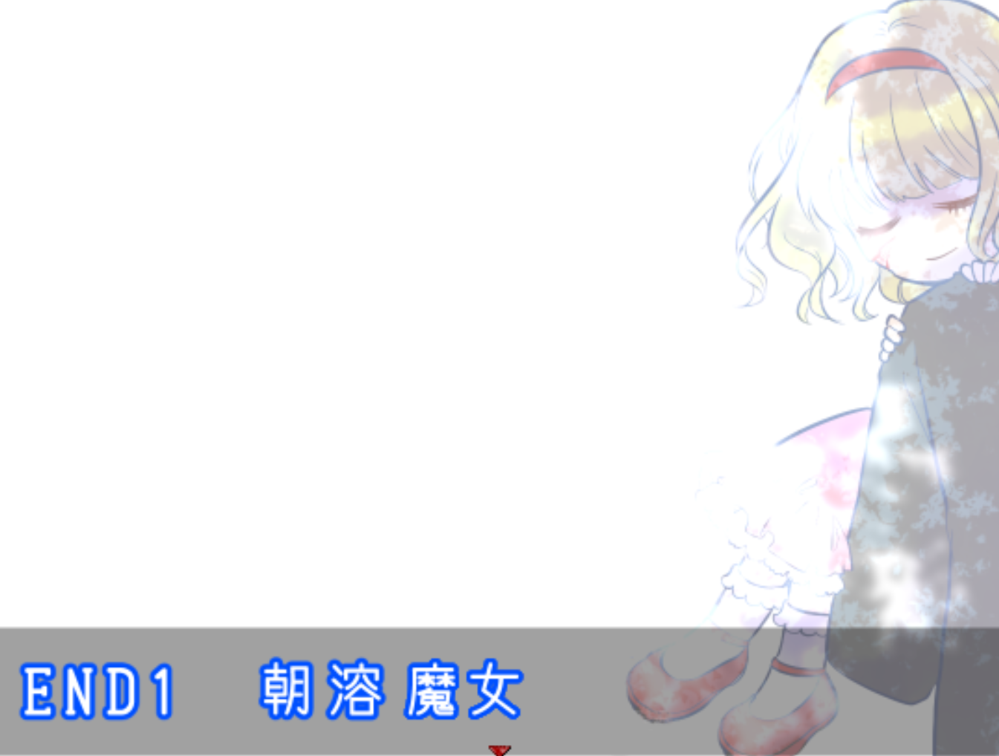

本次通关《朝溶魔女》（朝溶けの魔女），是一个典型的为所爱之人做残忍的故事。和《食人先生》（人喰いさん）很像。然而《食人先生》谜底藏的更深，也更吓人一些。

在游玩过程中领取了许多道具，我以为会有大用，结果全结局打完，也没有用到，不知道是用来干嘛的，游戏的槽点还是太多了。
我喜欢的是男主夏洛特和女主小唯的互动，小唯和夏洛特是青梅竹马，童年的性别互换，小唯作为“男孩子“勇敢保护夏洛特。而在长大后的重遇，这次就由夏洛特来保护小唯吧。但是两人互动也是不多，甚至没有表达心意，据说还有续作，希望可以多一些。

至于结局，十分草率，打败魔女的方式就是把魔女扔到阳光下，这个破解方法竟然是由魔女自己说的，这种情节设计太敷衍了。或许是因为流程太短了，故事都没能展开，夏洛特和小唯的人物塑造也不足，到最后留在我脑海里的，只有可爱的小唯了。

